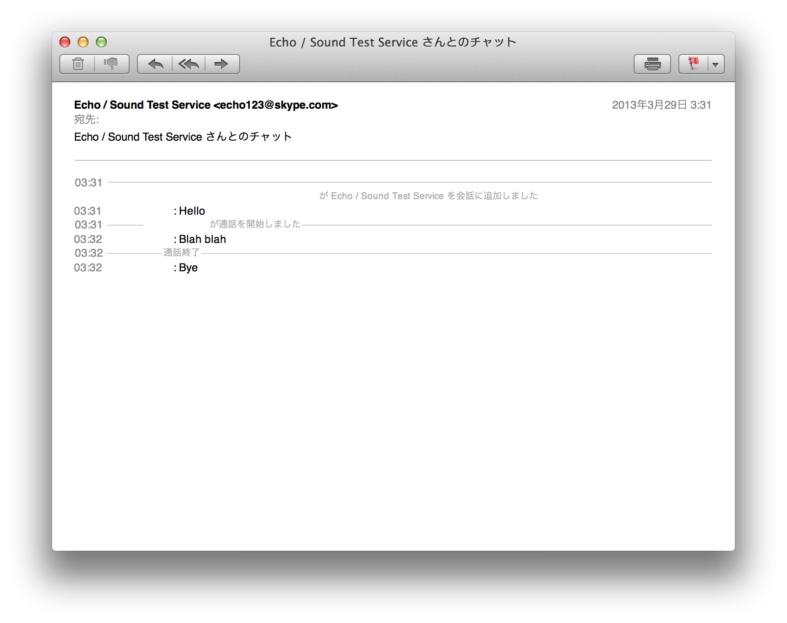

Skype Log Converter Classic
===========================

Skype Log Converter Classic is a utility that converts your Skype logs into clean, portable email format files (.eml).

A converted email has a similar format of Google Talk history in Gmail.

You can upload converted emails to Web mail services (like Gmail, Outlook.com, ...)
via your favorite Mail app, to access from anywhere.

Screenshots
-----------

Usage
-----
### Help

    $ skypelogconvclassic --help
    Usage: skypelogconvclassic [options]

    Options:
      -h, --help            show this help message and exit
      -o OUTPUT_DIR, --output-dir=OUTPUT_DIR
                            write output to OUTPUT_DIR
      -L LOCALE, --locale=LOCALE
                            set locale to LOCALE
      -T NAMETABLE, --name-table=NAMETABLE
                            load id-to-name table from NAMETABLE file
      -N, --no-write        do not output files
      -v, --verbose         print verbose output
      --debug               debug mode, same as -vv -N

### Example: Convert in English

    $ skypelogconvclassic -o ~/Documents/MyFolder \
    ~/Library/Application\ Support/Skype/echo123/main.db

  * `~/Documents/MyFolder` is an example output directory.
    Create it first by `mkdir -p ~/Documents/MyFolder`
  * Replace `echo123` to your own Skype name.

### Example: Convert in Japanese

    $ skypelogconvclassic -o ~/Documents/MyFolder -L ja \
    ~/Library/Application\ Support/Skype/echo123/main.db

Output files go like:

    $ ls ~/Documents/MyFolder
    skypelog-2Dl9X_.eml skypelog-GHp3sn.eml skypelog-UxAhYq.eml …

Output files will be named like `skypelog-<random name>.eml`.

Restrictions
------------

Skype Log Converter Classic reads Skype main.db, an sqlite3 database file,
and outputs each chatroom to emails.

Because Skype main.db specification is not opened,
there will be unknown types messages/actions, which will be ignored during conversion.

Currently, the converter supports the most types of messages, which are:

  * Normal message (type=61)
  * Set topic (type=2)
  * Create group discussion (type=4)
  * Add member into the room (type=10)
  * Kick member out of the room (type=12)
  * Set role (type=21)
  * Call start (type=30)
  * Call end (type=39)
  * Require Contact info (type=50)
  * Share Contact info (type=51)
  * Block user (type=53)
  * /me (type=60)
  * Send file (type=68)
  * Video message (type=70)
  * Birthday alert (type=110)
  * Media (type=201)

Even a message/action is in listed above, some of
additional information may not be converted.
(e.g. Unknown Call end reason, unknown Role, …)

Also, some other restrictions may be there;
e.g. convertion between skypeid and displayname may not work well.

You can see what will be ignored by

    skypelogconvclassic --no-write -vv PATH_TO_MAIN_DB

Or simply

    skypelogconvclassic --debug PATH_TO_MAIN_DB

Copyright and License
---------------------

(C)2013-2017 WATANABE Takuma <takumaw@sfo.kuramae.ne.jp>

This software is released under GPL v3 as provided in `GPL-3.0.txt`.
